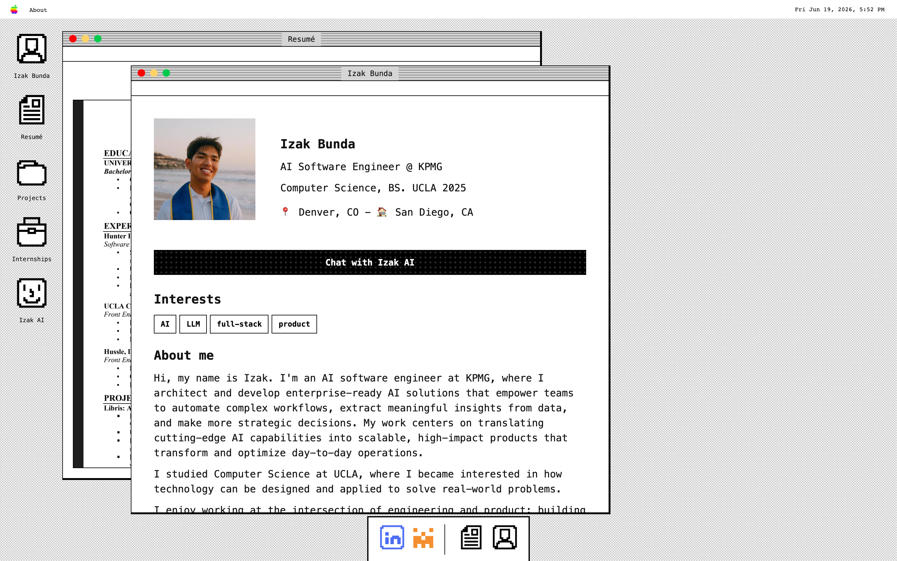
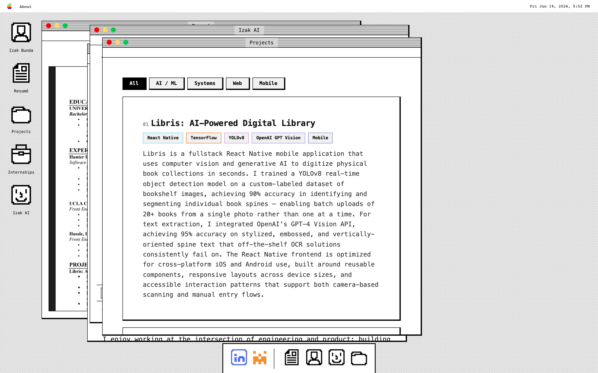
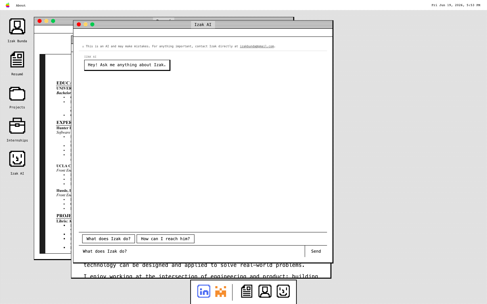
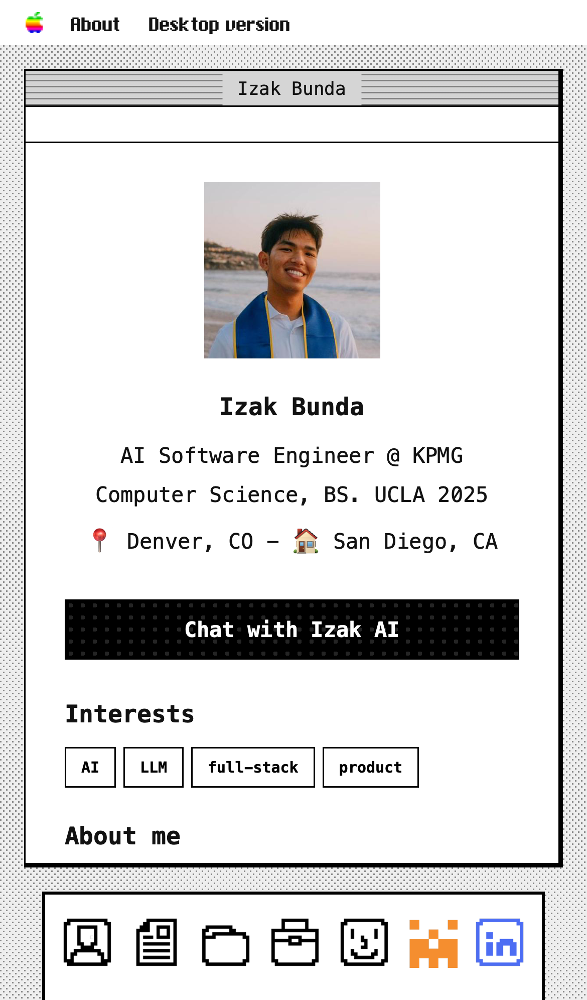
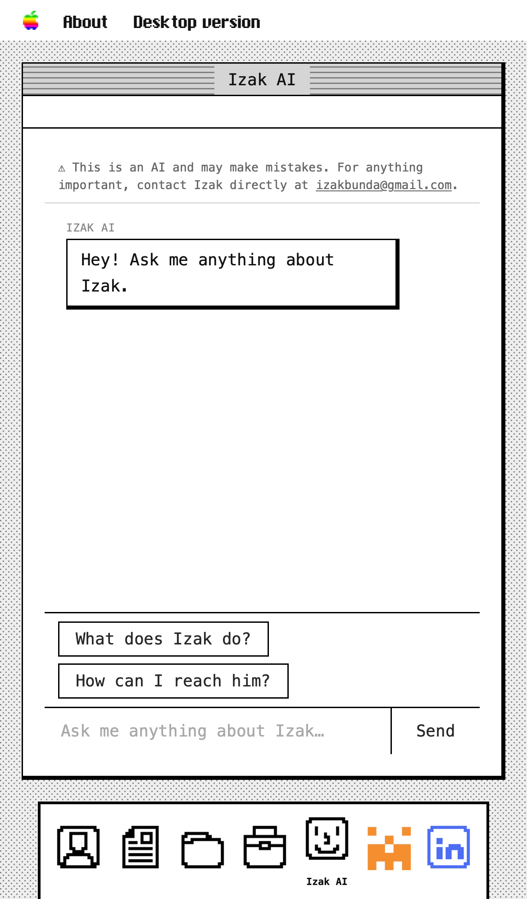

# Izak Bunda — Portfolio

A personal portfolio reimagined as a **classic Mac OS desktop**, complete with draggable windows, a dock, a menu-bar clock, customizable wallpaper, a **photography gallery**, and **Izak AI**, a retrieval-augmented chatbot that answers questions about Izak from his own knowledge base. A private, auth-gated **dashboard** is used to manage the gallery and to monitor site traffic and chatbot activity.

🔗 **Live:** [izakbunda.vercel.app](https://izakbunda.vercel.app)



---

## Overview

The site is a single-page React app that emulates a vintage desktop operating system. Each "app" (Profile, Resumé, Projects, Internships, Izak AI) opens in its own window you can drag, resize, minimize, and maximize. On mobile it gracefully collapses into a single full-screen app switched via a bottom dock.

The standout feature is **Izak AI** — a RAG (Retrieval-Augmented Generation) assistant backed by a Python agent. It retrieves relevant chunks from a curated knowledge base (résumé, projects, Q&A, writing) and answers in Izak's voice, with guardrails that keep it strictly on-topic.

A **Photography** app lets visitors browse published photo albums, managed through a private **/dashboard** that also surfaces anonymized site metrics (visitor sessions, resume downloads, link clicks) and a searchable log of every question asked to Izak AI.

---

## Features

| | |
|---|---|
| 🪟 **Windowing system** | Draggable, resizable windows with minimize / fullscreen, z-index focus stacking, and a cascade-spawn layout that clamps to the viewport. Open windows, positions, and sizes persist to `localStorage` across visits. |
| 🤖 **Izak AI (RAG chatbot)** | Streaming answers over SSE, markdown rendering, conversation starters, and a prompt-injection / jailbreak filter. |
| 📷 **Photography gallery** | Public masonry photo grid grouped by category with a "Featured" cross-category filter, lazy loading, pagination, and a fullscreen lightbox with keyboard/swipe navigation. |
| 🔒 **Private dashboard** | Supabase Auth-gated `/dashboard` for uploading and organizing photo albums, and for reviewing site metrics and chatbot activity (see below). |
| 📊 **Site metrics** | Anonymized visitor sessions (region, device, duration, referrer), resume-download and outbound-link tracking, and a per-session log of every Izak AI question and answer — all private to the dashboard owner. |
| 📱 **Mobile-first fallback** | Full-screen app view with a bottom dock, visual-viewport keyboard handling, and landscape lock. |
| 🎨 **Customizable wallpaper** | Right-click the desktop to set a custom background (persisted to `localStorage`). |
| 🕹️ **Retro details** | Animated blinking app icon, window click sounds, a live menu-bar clock, and an "Easter Eggs" panel. |

### Desktop — windowing system

Open multiple apps at once; windows cascade, stack, and focus like a real OS.



### Desktop — Izak AI chat

The RAG assistant with a disclaimer banner, conversation starters, and streaming markdown responses.



### Mobile

The desktop collapses into a single full-screen app with a bottom dock. The profile surfaces a "Chat with Izak AI" call-to-action.

| Profile | Izak AI |
|---|---|
|  |  |

### Photography gallery

A "Photography" desktop icon opens a public gallery of published albums, grouped into rows by category with a "Featured" filter shown by default. Photos load in a masonry grid with pagination and open in a fullscreen lightbox with keyboard/swipe navigation.

### Dashboard

`/dashboard` is gated behind Supabase Auth (email/password) and has four tabs:

- **Upload** — drag-and-drop multi-file photo upload with client-side HEIC conversion, EXIF/GPS stripping, downscaling, and thumbnail generation.
- **Manage** — album/category CRUD, drag-to-reorder, cover photo and month/year-taken selection, publish/unpublish at the album or photo level, soft delete (recoverable), and a "Featured" toggle.
- **Metrics** — anonymized visitor overview (sessions today/week/this month, average session length, resume downloads, chat questions asked) plus a line-by-line table of recent visitor sessions (region, device, referrer, duration, windows opened).
- **Chat** — every question asked to Izak AI, grouped by visitor session and expandable to read the full Q&A transcript, with failed responses flagged.

All metrics data is anonymous and session-scoped (no persistent visitor identity, no raw IP storage, no cookie banner) and is only ever readable by the authenticated dashboard owner — visitors can insert their own tracking events but cannot read anyone's data back, enforced by Postgres Row Level Security.

---

## Tech stack

**Frontend**
- [React 19](https://react.dev/) + [Vite 8](https://vitejs.dev/)
- [React Router 7](https://reactrouter.com/)
- [react-markdown](https://github.com/remarkjs/react-markdown) for chat formatting
- [react-slick](https://react-slick.neostack.com/) for project image carousels
- [heic2any](https://github.com/alexcorvi/heic2any) for client-side HEIC→JPEG conversion on photo upload
- [@supabase/supabase-js](https://github.com/supabase/supabase-js) for auth, Postgres, and Storage access directly from the client
- Plain CSS modules per component (no UI framework) with custom retro fonts

**Backend — `agent/` (Python)**
- [FastAPI](https://fastapi.tiangolo.com/) with Server-Sent Events streaming
- [LangGraph](https://langchain-ai.github.io/langgraph/) `create_react_agent` (ReAct loop)
- [DeepSeek](https://www.deepseek.com/) (`deepseek-chat`) as the LLM, via the OpenAI-compatible API
- [OpenAI embeddings](https://platform.openai.com/docs/guides/embeddings) (`text-embedding-3-small`) for retrieval
- [Supabase](https://supabase.com/) + [pgvector](https://github.com/pgvector/pgvector) as the vector store
- [slowapi](https://github.com/laurentS/slowapi) rate limiting (10 req/min per IP)

**Infrastructure**
- **Vercel** — frontend hosting, plus an [Edge Middleware](https://vercel.com/docs/functions/edge-middleware) (via [`@vercel/edge`](https://www.npmjs.com/package/@vercel/edge)) that reads built-in request geolocation to power anonymized region tracking, without the app ever handling raw IPs
- **Railway** — Python agent hosting
- **Supabase** — managed Postgres + pgvector, Auth (dashboard login), Storage (photo/thumbnail buckets), and Row Level Security-gated metrics tables

---

## Architecture

```
┌─────────────────┐    POST /chat (SSE)    ┌──────────────────────┐
│  React frontend │ ─────────────────────► │  FastAPI (Railway)   │
│   (Vercel)      │ ◄───────────────────── │  - jailbreak filter  │
└─────────────────┘   streamed tokens      │  - rate limiter      │
                                           │  - LangGraph agent   │
                                           └──────────┬───────────┘
                                                      │ retrieve_context tool
                                          ┌───────────▼────────────┐
                                          │ OpenAI embeddings      │
                                          │ → Supabase pgvector    │
                                          │   match_documents()    │
                                          └────────────────────────┘
```

**Request flow for a chat message:**
1. The frontend POSTs the message history to `/chat` and reads the SSE stream.
2. FastAPI runs a regex **pre-flight filter** for prompt-injection / jailbreak attempts and short-circuits with a canned reply if matched.
3. The **LangGraph ReAct agent** (DeepSeek) decides to call the `retrieve_context` tool.
4. The tool embeds the query with OpenAI and calls Supabase's `match_documents` RPC for the top-k similar chunks (cosine similarity over pgvector).
5. The agent composes an answer grounded in those chunks and streams tokens back to the client.

**Knowledge base** lives in `agent/ingest/sources/` as markdown (`resume.md`, `projects.md`, `qa.md`, `substack.md`). Running the ingest script chunks, embeds, and upserts them into Supabase (idempotently).

**Site metrics** are written directly from the browser to Supabase (anon key, insert-only via RLS) — there's no dedicated metrics backend. A root-level `middleware.js` runs on Vercel's Edge network in front of every request, reads Vercel's built-in geolocation, and sets a short-lived `geo` cookie the SPA reads on load; the app never sees or stores a raw IP. A per-tab session ID (in `sessionStorage`) ties together a `sessions` row, `events` rows (window opens, resume clicks, outbound link clicks), and `chat_messages` rows (every Izak AI question + answer), all readable only by the authenticated dashboard owner.

---

## Project structure

```
.
├── index.html
├── middleware.js                # Vercel Edge Middleware: sets anonymized geo cookie for metrics
├── src/                         # React frontend
│   ├── pages/
│   │   ├── Home/                # Desktop + mobile layout, window manager, keyboard handling
│   │   └── Dashboard/           # Auth-gated /dashboard: Upload, Manage, Metrics, Chat tabs
│   ├── lib/
│   │   ├── supabase.js          # Supabase client (anon key)
│   │   ├── gallery.js           # Album/photo/category CRUD
│   │   ├── imageProcessing.js   # HEIC conversion, EXIF/GPS stripping, downscaling, thumbnails
│   │   ├── metrics.js           # Session lifecycle, event + chat-message tracking (writes)
│   │   └── metricsQueries.js    # Dashboard aggregate queries (reads)
│   └── components/
│       ├── Window/              # Window chrome + app router
│       ├── Chat/                # Izak AI chat UI (SSE streaming, markdown)
│       ├── Gallery/             # Public photography grid + lightbox
│       ├── Profile/ Resume/ …   # Individual "apps"
│       ├── Dock/ MenuBar/       # OS chrome
│       └── MobileBanner/ WallpaperMenu/ EasterEggs/
└── agent/                       # Python RAG backend
    ├── app/
    │   ├── main.py              # FastAPI app, SSE endpoint, rate limit, jailbreak filter
    │   ├── agent.py             # LangGraph agent + system prompt / guardrails
    │   ├── retriever.py         # retrieve_context tool (embeddings + Supabase RPC)
    │   └── config.py            # env var loading
    ├── ingest/
    │   ├── ingest.py            # chunk → embed → upsert pipeline
    │   └── sources/*.md         # the knowledge base
    └── supabase/
        ├── schema.sql                    # documents table + match_documents RPC
        ├── gallery_schema*.sql           # albums/photos tables, categories, soft delete, featured flag
        └── metrics_schema.sql            # sessions/events/chat_messages tables + RLS
```

---

## Local development

### Frontend

```bash
npm install
npm run dev          # http://localhost:5173
```

Create a `.env` (see `.env.example`):

```
VITE_AGENT_URL=http://localhost:8000   # or your deployed Railway URL
VITE_SUPABASE_URL=https://xxx.supabase.co
VITE_SUPABASE_ANON_KEY=eyJ...
```

The Vite dev server also proxies `/agent` → `http://localhost:8000`.

The gallery, dashboard, and site metrics all read/write Supabase directly from the client with the anon key above — run the SQL files in `agent/supabase/` (`gallery_schema*.sql`, `metrics_schema.sql`) once in the Supabase SQL editor, and create a user in Supabase Auth to sign into `/dashboard` with.

### Backend (`agent/`)

```bash
cd agent
python -m venv venv && source venv/bin/activate
pip install -r requirements.txt
```

Create `agent/.env` (see `agent/.env.example`):

```
OPENAI_API_KEY=sk-...
DEEPSEEK_API_KEY=sk-...
SUPABASE_URL=https://xxx.supabase.co
SUPABASE_SERVICE_KEY=eyJ...
```

One-time vector store setup:

```bash
# 1. Run agent/supabase/schema.sql in the Supabase SQL editor
# 2. Populate the knowledge base
python ingest/ingest.py
# 3. Start the API
uvicorn app.main:app --reload   # http://localhost:8000
```

---

## Deployment

- **Frontend** auto-deploys to Vercel on push to `main`. Set `VITE_AGENT_URL`, `VITE_SUPABASE_URL`, and `VITE_SUPABASE_ANON_KEY` in the Vercel project. `vercel.json` rewrites all routes to `index.html` so client-side routes like `/dashboard` work on direct load, and `middleware.js` runs automatically as Vercel Edge Middleware — no separate deployment step.
- **Backend** deploys to Railway with the project root set to `agent/`. The `Procfile` binds uvicorn to Railway's `$PORT`. Set the four env vars above plus add the production frontend origin to `ALLOWED_ORIGINS` in `app/main.py`.
- **Database** is a Supabase project with the `vector` extension enabled, plus the gallery and metrics tables from `agent/supabase/`.

---

## License

Personal project — all rights reserved. Feel free to draw inspiration, but please don't clone it wholesale as your own portfolio.
